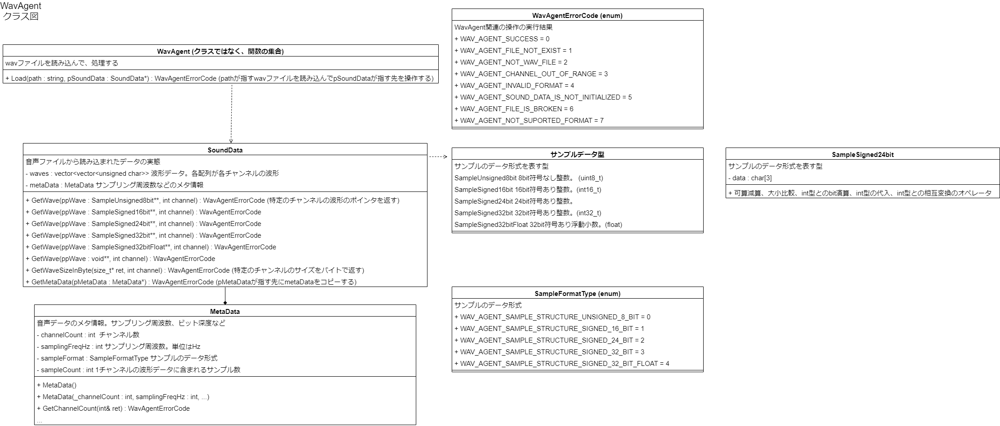

# WavAgent

wav ファイルを読み込むライブラリ。OpenAL での使用を見越して、wav ファイルからサンプリング周波数等のメタデータと、波形データを読み込む。左右のチャンネルにも対応する。

## クラス図(概要)



## 使用例

読み込みたい wav ファイルのパスと、データを設定してほしい `SoundData` のポインタを与え、 `Load` 関数を呼び出す。

```C++
SoundData soundData = SoundData();
Load("data/sound.wav", &soundData);
```

`SoundData` は波形データとメタデータを持つ。波形データは、各チャンネルごとに、 `int` の `vector` となっている。元の波形データの 1 サンプルが 32bit だった場合は、1 要素で 1 サンプルを表現する。元の波形データが、16bit だった場合は、1 要素で 2 つのサンプルを表現する。元の波形データが 8bit だった場合は、1 要素で 2 つのサンプルを表現する。 `int` 型の 32bit の余っている部分に入る値は不定。例えば 1 サンプルが 8bit で、サンプル数を 4 で割った時の余りが 3 の時、残りの 8bit が 0 で埋まっているとは限らない。ユーザに対してはこの実装は隠蔽される。

`SoundData` に含まれる、あるチャンネルの波形を取得するためには、 `GetWave` 関数を使用する。チャンネルは 0-indexed に指定する。なので、チャンネル 1 の波形を取得するためには、0 番の波形データを取得する。波形データは要求する形式の配列先頭のポインタとして渡される。以下の例であれば、符号付き 16bit の波形データのチャンネル 1 を要求している。

```C++
SampleSigned16bit *pWave = nullptr;
soundData.GetWave(&pWave, 0);
```

サウンドのチャンネル数やサンプリング周波数などのメタデータを取得する場合は、 `SoundData` が保持する `MetaData` を参照する。 `WavAgent` から `SoundData` を取得した時と同様に `MetaData` のポインタのポインタを `SoundData` の `GetMetaData` に渡すと、そのポインタが `SoundData` が保持する `MetaData` を指すようになる。

```C++
MetaData *pMetaData = nullptr;
soundData.GetMetaData(&pMetaData);
```

なお、全ての関数操作は、返り値として `WavAgentErrorCode` の値を返す。返り値が `WAV_AGENT_SUCCESS` であれば正常終了しており、それ以外であれば、何らかのエラーが発生している。エラーの種類は `WavAgentErrorCode` の値を調べれば分かる。

```C++
WavAgentErrorCode ret = wavAgent.Load("data/sound.wav", &soundData);
if(ret != WavAgentErrorCode::WAV_AGENT_SUCCESS)
{
    std::cerr << "error!" << std::endl;
}
```

`WavAgentErrorCode` は `<<` 演算子をオーバーロードしているので、`cout` 等に出力することが出来る。

```C++
std::cout << WavAgentErrorCode::WAV_AGENT_SUCCESS << std::endl;
// WAV_AGENT_SUCCESSと出力される
```

エラーの詳細な原因調べるためには `ConvertWavAgentErrorCodeToDescription` 関数を使用する。

```C++
std::cout <<
ConvertWavAgentErrorCodeToDescription(WavAgentErrorCode::WAV_AGENT_SUCCESS)
 << std::endl;
// WavAgent : Operation successfully completed. と出力される。
```

# Load

## 概要

渡されたパスが指す wav ファイルを読み込み、引数に渡された `SoundData` のポインタの指す先に波形データなどをロードする。

## 引数

### path : `const std::string&`

読み込み対象の wav ファイルのパス。相対パスでも絶対パスでも良い。

### pSoundData : `SoundData*`

wav ファイルから読み込んだデータを格納する先を示すポインタ。呼び出し側でオブジェクトを作成しておき、そのポインタを渡す必要がある。

## 返り値 : `WavAgentErrorCode`

正常に処理が終了したら `WAV_AGENT_SUCCESS` を返す。

存在しないファイルを指定した場合、 `WAV_AGENT_FILE_NOT_EXIST` を返す。

wav ファイルでないファイルを指定した場合、 `WAV_AGNET_NOT_WAV_FILE` を返す。

# SoundData

wav ファイルから読み込まれたデータを保持するオブジェクト。波形データを保持し、メタデータを保持する `MetaData` オブジェクトを有する。

## GetWave

波形データを取得する。波形のサンプルのフォーマットに応じて、 `SampleUnsigned8bit`, `SampleSigned16bit`, `SampleSigned24bit`, `SampleSigned32bit`, `SampleSigned32bitFloat` それぞれとして波形データを読み込む関数を 5 つオーバーロードしている。

### 引数

#### ppWave : `SampleUnsigned8bit**, SampleSigned16bit**,...`

波形データのポインタのポインタ。 `SampleUnsigned8bit` など対応するフォーマットのポインタのポインタを渡すと、そのポインタが指す先が `SoundData` 内の波形データになる。

```c++
SampleUnsigned8bit *pWave=nullptr
soundData.GetWave(&pWave, 0);
```

`SoundData` が破棄されると、波形データも破棄されてしまうので、寿命に注意。

要求するチャンネルやフォーマットが不適切な場合は `nullptr` を指すようになる。

#### channel : int

読み込み対象の波形データのチャンネル。0-indexed なので、チャンネル 1 のデータを読み込む場合は 0 を指定する。

### 返り値 : `WavAgentErrorCode`

正常に終了したら `WAV_AGENT_SUCCESS` を返す。

存在しないチャンネルのデータを読み込もうとすると `WAV_AGENT_CHANNEL_OUT_OF_RANGE` を返す。

wav ファイルが提供するフォーマットとは異なるフォーマットの `ppWave` を渡した場合は、 `WAV_AGENT_INVALID_FORMAT` を返す。

`Load` 関数で適切に作成されていない `SoundData` に対して呼び出すと、 `WAV_AGENT_SOUND_DATA_IS_NOT_INITIALIZED` を返す

## GetMetaData

`SoundData` が保持するメタデータのポインタを返す。

### 引数

#### ppMetaData : `MetaData**`

メタデータのポインタのポインタ。このポインタの指す先が、 `SoundData` が保持する `MetaData` オブジェクトになる。

### 返り値 : WavAgentErrorCode

正常に処理が完了したら `WAV_AGENT_SUCCESS` を返す。

`Load` 関数で適切に作成されていない `SoundData` に対して呼び出すと、 `WAV_AGENT_SOUND_DATA_IS_NOT_INITIALIZED` を返す。
